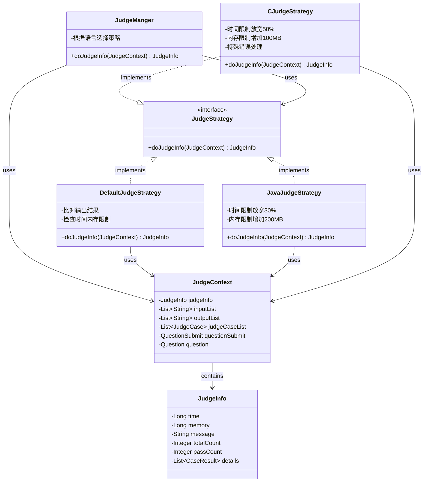
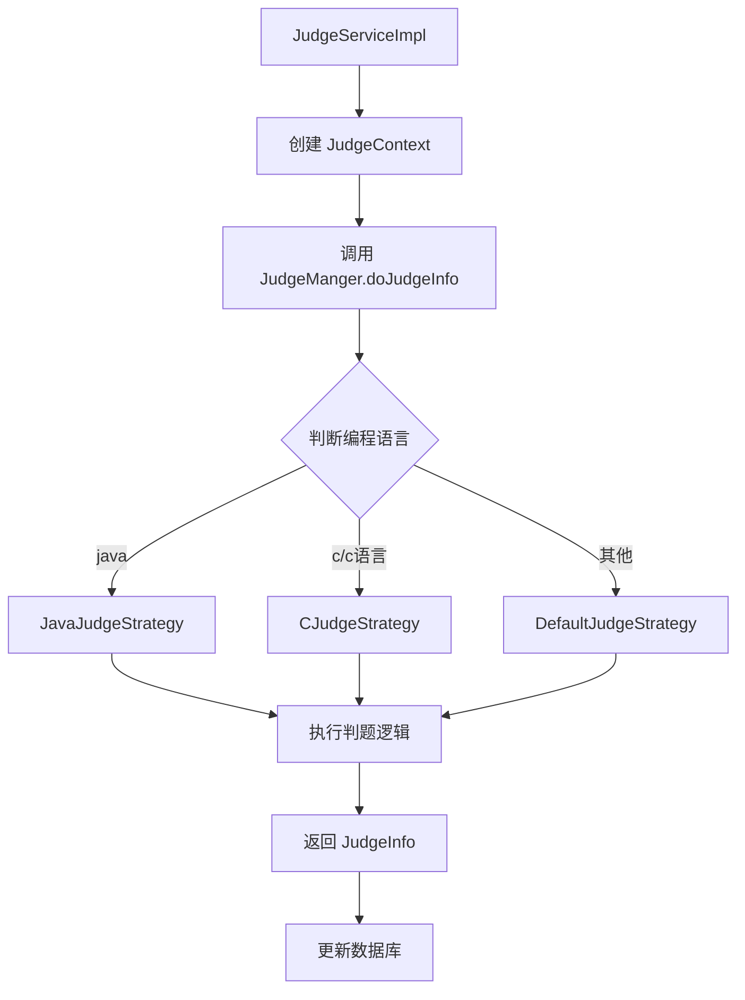

# 判题策略模式 - 类图

## UML 类图 (Mermaid)



## 策略选择流程



## 设计模式说明

### 策略模式 (Strategy Pattern)

**核心组件:**

1. **策略接口 (Strategy)**: `JudgeStrategy`
   - 定义统一的判题算法接口

2. **具体策略 (Concrete Strategy)**:
   - `DefaultJudgeStrategy` - 默认判题策略
   - `JavaJudgeStrategy` - Java 特定策略 (放宽资源限制)
   - `CJudgeStrategy` - C 语言特定策略 (特殊错误处理)

3. **上下文 (Context)**: `JudgeManger`
   - 根据编程语言动态选择合适的判题策略

4. **数据载体**: `JudgeContext`
   - 封装判题所需的所有数据

### 策略差异对比

| 策略 | 时间限制 | 内存限制 | 特殊处理 |
|------|---------|---------|---------|
| DefaultJudgeStrategy | 标准 | 标准 | 精确匹配 |
| JavaJudgeStrategy | +30% | +200MB | trim() 比较 |
| CJudgeStrategy | +50% | +100MB | 编译/运行时错误 |

### 优势

- ✅ 易于扩展新语言的判题策略
- ✅ 每种语言的判题逻辑独立,互不影响
- ✅ 符合开闭原则 (对扩展开放,对修改关闭)
- ✅ 代码复用性高,维护成本低

### 使用示例

```java
// 在 JudgeManger 中根据语言选择策略
JudgeStrategy judgeStrategy = new DefaultJudgeStrategy();

if ("java".equals(language)) {
    judgeStrategy = new JavaJudgeStrategy();
} else if ("c".equals(language) || "c语言".equals(language)) {
    judgeStrategy = new CJudgeStrategy();
}

return judgeStrategy.doJudgeInfo(judgeContext);
```
